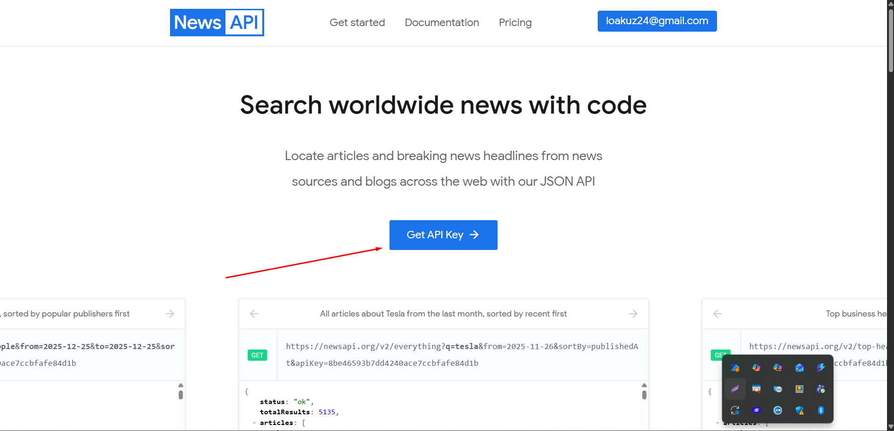

# Technical Assessment – REST API with Express

## Overview

This project is a small technical assessment designed to demonstrate code structure, clarity, and best practices when building a REST API with Node.js and Express.

The goal of the API is to consume data from a public external API (such as OpenWeatherMap or a similar free service), process and normalize the data, and expose one or more custom endpoints with meaningful, structured responses.

The implementation focuses on clean architecture, input validation, error handling, caching, and basic testing.

## 🛠️ Tech Stack

- Node.js
- Express
- JavaScript
- Vitest
- Axios / Fetch

## 🚀 Getting Started

### Prerequisites

- Node.js (v18 or higher recommended)
- npm

### Installation

```bash
npm install
```

### Environment Variables

Create a .env file at the root of the project and define the required variables:

```env
PORT=3000
EXTERNAL_API_KEY=your_api_key_here
```

### Obtaining your NewsAPI Key

To use the `/news` endpoint, you need a NewsAPI API key. Follow these steps:

1. Go to [https://newsapi.org](https://newsapi.org).
2. Click on the **"Get API Key"** button. The image below shows where to click:
3. Complete the registration form to create your api key.
4. Copy the generated API key and paste it into your `.env` file.



> The red arrow in the image points to the button where you can generate your API key.

### Running the Project

```bash
npm run dev
```

The server will start on `http://localhost:3000`

### Running Tests

```bash
npm test
```

This will run all tests configured with Vitest and display the results report in the console.

## 📁 Project Structure ( example )

```
src/
 ├── controllers/
 ├── services/
 ├── routes/
 ├── utils/
 ├── schemas/
 |── app.js
 └── server.js
```

## ✅ Features Implemented

- Consumption of an external public API
- Input validation with proper error handling
- Normalized and consistent response structure
- In-memory caching with a TTL of 10 minutes
- Simple in-memory history of recent queries
- Basic test coverage:
  - At least one service test
  - At least one controller test

## API Endpoints

This project exposes two main endpoints: `/news` and `/history`.

### 1. POST `/news`

Fetches the latest news on a given topic and optionally filters by relevance, popularity, or publication date.  
It also caches the results in memory for 10 minutes to improve performance.

**Request Body (JSON):**

```json
{
  "topic": "bitcoin",
  "filterBy": "relevancy", // optional: "relevancy" | "popularity" | "publishedAt"
  "page": 1 // optional: page number for pagination
}
```

**Response (JSON):**

```json
{
  "fromCache": false,
  "totalResults": 120, 
  "page": 1,
  "news": [
    {
      "title": "Bitcoin hits new high",
      "source": "CryptoNews",
      "author": "John Doe",
      "publishedAt": "2025-12-26T18:34:12Z",
      "url": "https://cryptonews.com/article/bitcoin"
    },
    ...
  ]
}
```

- fromCache: true if the result came from the cache, false if fetched from the external API.
- totalResults: total number of news found for the topic.
- page: current page number.
- news: array of news news (max 5).

### 2. GET `/history`

Returns the list of the last news queries made to /news, including topic, filter, and timestamp.

**Response (JSON):**

```json
[
  {
    "topic": "bitcoin",
    "filterBy": "relevancy",
    "requestedAt": "2025-12-26T18:34:12.345Z"
  },
  {
    "topic": "tesla",
    "filterBy": "popularity",
    "requestedAt": "2025-12-26T18:36:45.678Z"
  }
]
```

- Useful to see the recent queries stored in the server memory.
- The list is stored in-memory and will be cleared when the server restarts.

### API Decisions / Limits

The API consumes data from NewsAPI, a free public news service.  
To ensure consistent responses and avoid overwhelming the user with information, each request to the `/news` endpoint returns **a maximum of 5 news** with pagination possible, by querying the next 5 news in the list.

Users can filter results using the `filterBy` parameter, which accepts three options:

- `relevancy` – returns news most relevant to the topic.  
- `popularity` – returns news that are currently most popular.  
- `publishedAt` – returns news sorted by publication date (default).  

These limits provide useful information to the client, and I also wanted an additional parameter for the request body.

### Technical Decisions

- **Input Validation with Zod:** I chose Zod to validate request bodies because it provides a clear, declarative schema definition and generates meaningful error messages. This ensures that the `/news` endpoint only processes valid topics and filter options.

- **Error Handling and Failed Requests:** All errors, including validation failures, are handled. Invalid requests are returned with a clear error message, and **all attempts—successful or failed—are recorded in the in-memory history**. Failed queries are marked with `failed: true` to distinguish them from successful requests, making it easier to debug and track usage for potential business decisions.
